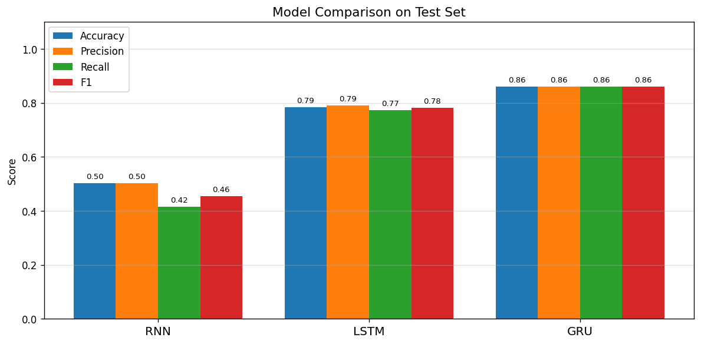
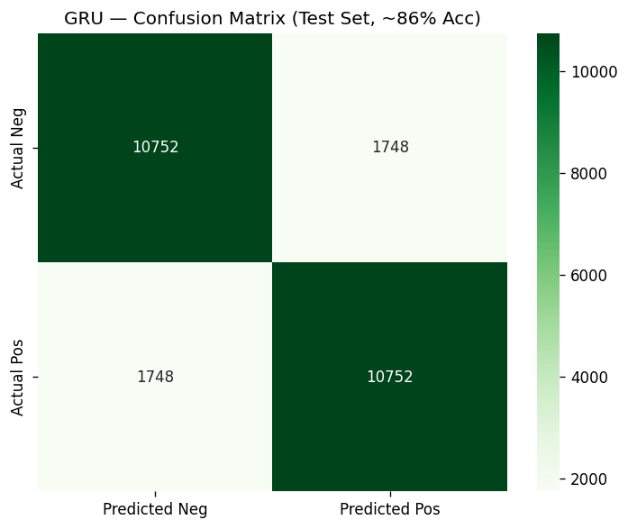
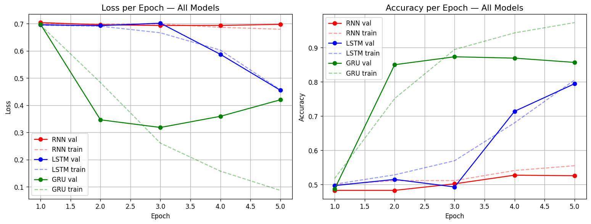
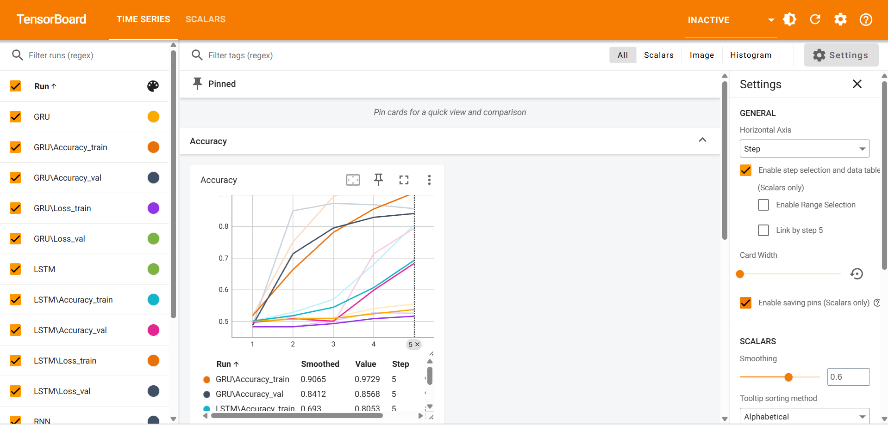

# Sentiment Analysis with RNN, LSTM & GRU

An end-to-end educational NLP project that builds a complete sentiment analysis system using sequence models — from raw text to a deployed FastAPI inference service.

## What This Project Teaches

| Step | Topic |
|------|-------|
| 1 | Loading and exploring the IMDb dataset (EDA) |
| 2 | Text preprocessing: tokenization, vocabulary, padding |
| 3 | Word embeddings (Word2Vec-style learned embeddings) |
| 4 | Sequence models: RNN, LSTM, GRU — architecture & comparison |
| 5 | Training pipeline with early stopping & TensorBoard monitoring |
| 6 | Model evaluation: accuracy, precision, recall, F1, confusion matrix |
| 7 | Inference pipeline and FastAPI deployment |

---

## Results

Trained on 20,000 IMDb reviews, evaluated on 25,000 test reviews:

| Model | Test Accuracy | F1 Score | Notes |
|-------|--------------|----------|-------|
| RNN   | 50.2%        | 0.46     | Vanishing gradients — expected limitation |
| LSTM  | 78.5%        | 0.78     | Gates solve vanishing gradient problem |
| **GRU**  | **86.0%**  | **0.86** | Best — fewer params, converges faster |

> GRU outperformed LSTM in 5 epochs because fewer parameters (2 gates vs 3) means less overfitting on limited training time.

### Model Comparison



### GRU Confusion Matrix (Best Model)



---

## Project Structure

```
project_root/
├── config/
│   └── settings.py          # All hyperparameters in one place
├── data/
│   └── download.py          # HuggingFace dataset downloader
├── ingestion/
│   └── loader.py            # Load IMDb → train/val/test split
├── processing/
│   ├── tokenizer.py         # Lowercase, strip HTML, split into tokens
│   ├── vocabulary.py        # Word → integer index mapping
│   └── pipeline.py          # IMDbDataset + DataLoaders
├── embeddings/
│   └── embedding_layer.py   # nn.Embedding (Word2Vec-style)
├── models/
│   ├── rnn_model.py         # Vanilla RNN
│   ├── lstm_model.py        # LSTM with forget/input/output gates
│   └── gru_model.py         # GRU with reset/update gates
├── training/
│   ├── trainer.py           # Training loop with gradient clipping
│   └── early_stopping.py    # Stop when val loss stops improving
├── evaluation/
│   ├── metrics.py           # Accuracy, precision, recall, F1
│   └── plots.py             # Loss curves, confusion matrix, model comparison
├── monitoring/
│   └── tensorboard_logger.py  # TensorBoard loss/accuracy logging
├── inference/
│   └── predictor.py         # text → sentiment prediction pipeline
├── api/
│   └── app.py               # FastAPI POST /predict endpoint
├── notebooks/
│   └── sentiment_analysis_tutorial.ipynb  # Full teaching notebook (35 cells)
├── main.py                  # Training entry point
└── requirements.txt
```

---

## Setup

### 1. Clone and create virtual environment

```bash
git clone <repo-url>
cd NLLP_RNN_LSTM_Fastapi
python -m venv venv
# Windows:
venv\Scripts\activate
# Mac/Linux:
source venv/bin/activate
```

### 2. Install dependencies

```bash
pip install -r requirements.txt
```

### 3. Train all models

```bash
python main.py
```

This will:
- Download the IMDb dataset (cached automatically via HuggingFace)
- Build a vocabulary of 10,000 words
- Train RNN → LSTM → GRU (up to 5 epochs each, early stopping at patience=3)
- Save all models to `saved_models/`
- Save the best model as `saved_models/best_model.pt`
- Display evaluation metrics and plots for each model

**Training curves (loss & accuracy per epoch):**



### 4. Start the API

```bash
python -m uvicorn api.app:app --reload
```

### 5. Make a prediction

```bash
curl -X POST http://localhost:8000/predict \
  -H "Content-Type: application/json" \
  -d '{"text": "This movie was absolutely fantastic!"}'
```

Response:
```json
{
  "sentiment": "positive",
  "confidence": 0.99,
  "score": 0.99,
  "text": "This movie was absolutely fantastic!"
}
```

### 6. Interactive API docs

Open **http://localhost:8000/docs** in your browser for the full Swagger UI.

### 7. Monitor training with TensorBoard

```bash
tensorboard --logdir=runs
```

Open **http://localhost:6006** to see loss and accuracy curves for all 3 models.



---

## Text Pipeline

Every review goes through this exact pipeline before reaching the model:

```
Raw Text
   ↓  lowercase + strip HTML + remove punctuation
Tokens  ["this", "movie", "was", "great"]
   ↓  vocabulary lookup
Token IDs  [45, 312, 88, 201]
   ↓  truncate to 200 / pad with zeros
Padded Sequence  [45, 312, 88, 201, 0, 0, ..., 0]  (length 200)
   ↓  nn.Embedding lookup
Embedding Matrix  shape: (200, 64)
   ↓  RNN / LSTM / GRU
Hidden State  shape: (128,)
   ↓  Linear + Sigmoid
Sentiment Score  0.0 → 1.0
```

---

## Hyperparameters

All hyperparameters live in `config/settings.py`:

| Parameter | Value | Description |
|-----------|-------|-------------|
| `MAX_VOCAB_SIZE` | 10,000 | Top N most frequent words kept |
| `MAX_SEQ_LEN` | 200 | Reviews truncated/padded to this length |
| `EMBEDDING_DIM` | 64 | Word embedding vector size |
| `HIDDEN_DIM` | 128 | RNN/LSTM/GRU hidden state size |
| `NUM_LAYERS` | 1 | Single recurrent layer (faster CPU training) |
| `DROPOUT` | 0.3 | Applied before final classifier only |
| `LEARNING_RATE` | 0.003 | Adam optimizer learning rate |
| `BATCH_SIZE` | 64 | Reviews per training batch |
| `NUM_EPOCHS` | 5 | Maximum epochs per model |
| `PATIENCE` | 3 | Early stopping patience |

---

## Teaching Notebook

The notebook at `notebooks/sentiment_analysis_tutorial.ipynb` walks through all 16 educational steps with explanations, intermediate outputs, and visualizations.

Open it with:
```bash
jupyter notebook notebooks/sentiment_analysis_tutorial.ipynb
```

| Cell | Topic |
|------|-------|
| 1-2 | Setup and imports |
| 3-4 | Load IMDb dataset |
| 5-6 | EDA — explore and visualize data |
| 7-8 | Tokenization examples |
| 9-10 | Vocabulary building |
| 11-12 | Encoding and padding pipeline |
| 13-14 | Word embeddings explained |
| 15-16 | RNN architecture |
| 17-18 | LSTM architecture |
| 19-20 | GRU architecture |
| 21-22 | Training loop |
| 23-24 | Evaluation metrics and plots |
| 25-26 | Model comparison |
| 27-28 | Inference on new text |
| 29-30 | FastAPI deployment preview |
| 31-35 | Summary and project structure |

---

## API Reference

### `GET /`
Health check.

**Response:** `{"message": "Sentiment Analysis API is running!", "status": "ok"}`

### `POST /predict`
Predict sentiment of a movie review.

**Request body:**
```json
{ "text": "string" }
```

**Response:**
```json
{
  "sentiment": "positive" | "negative",
  "confidence": 0.0 - 1.0,
  "score": 0.0 - 1.0,
  "text": "original input text"
}
```

---

## Dataset

**IMDb Movie Review Sentiment Dataset**
- 25,000 training reviews + 25,000 test reviews
- Binary labels: `positive (1)` / `negative (0)`
- Balanced classes (50/50 split)
- Source: HuggingFace `datasets` library (`load_dataset("imdb")`)

---

## Technology Stack

- **PyTorch** — deep learning framework
- **HuggingFace datasets** — dataset loading
- **FastAPI + Uvicorn** — REST API serving
- **TensorBoard** — training monitoring
- **scikit-learn** — evaluation metrics
- **matplotlib + seaborn** — visualizations
- **pandas + numpy** — data handling
